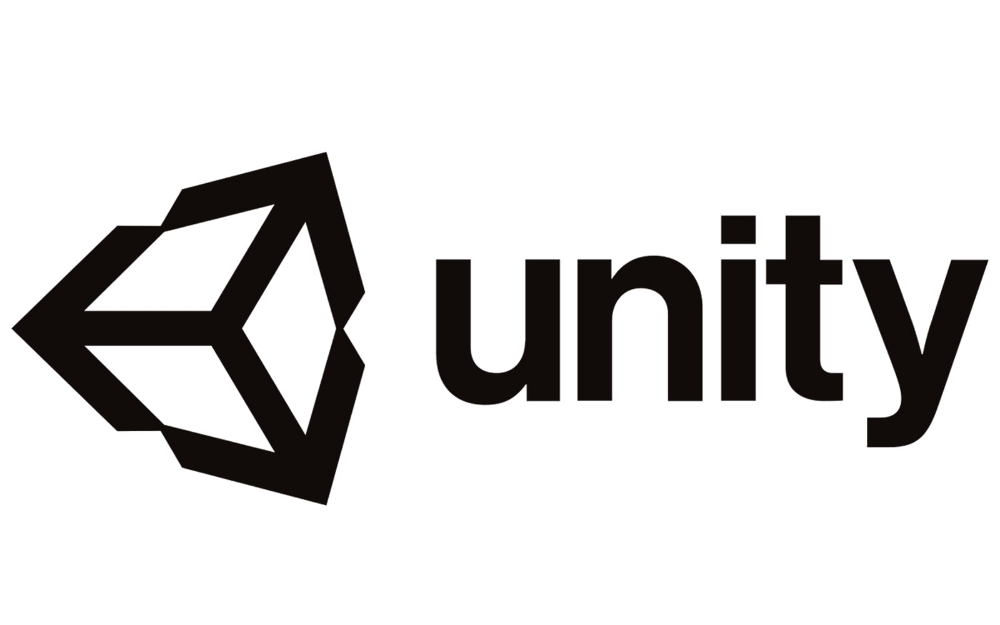

<br/>
<p align="center">
    <a href="https://github.com/TerraMystics"></a>
</p>

<p align="center">
A lightweight payment management library for the terra ecosystem

</p>
<br/>

<p align="center">
  <a href="https://github.com/TerraMystics/Terra.Net.OnChainPayments/blob/main/LICENSE">
  
  </a>
    
  <a href="https://www.nuget.org/packages/Terra.Net.OnChainPayments">
    
  </a>
  
  <a href="https://www.nuget.org/packages/Terra.Net.OnChainPayments">
    
  </a>
</p>

<p align="center">
  <a href="https://docs.terra.money/"><strong>Explore the Docs »</strong></a>
  <br />
  <br/>
  <a href="https://github.com/TerraMystics/Terra.Net.OnChainPayments/tree/main/Terra.Net.OnChainPayments/OnChainPaymentsSimulator">Example App</a>
  ·
  <a href="https://github.com/TerraMystics/Terra.Net.OnChainPayments">API Reference</a>
  ·
  <a href="https://www.nuget.org/packages/Terra.Net.OnChainPayments">NuGet Package</a>
  ·
  <a href="https://github.com/TerraMystics/Terra.Net.OnChainPayments">GitHub</a>
</p>

Internally manages gas estimation required by the burn tax for successful transactions on the blockchain. Makes it easier for devs to get started with payments on the LUNC/LUNA Blockchains.

## Features

- **Written in C#**, with type definitions
- Works with Xamarin, Unity, Asp, and all other frameworks in the .Net Ecosystems
- Makes it easier to manage payments for anyone deploying to the Apple or Google app stores

## Installation & Configuration

Please make sure to import the following [package](https://github.com/TerraMystics/Terra.Unity.Package/blob/main/terra.payments.unitypackage) into your project as an asset.

Please also make sure to install the following [dependency](https://github.com/jilleJr/Newtonsoft.Json-for-Unity/wiki/Install-official-via-UPM) package into your project too.

## Usage

This package can be used for Mobile & Web Developers, or SDK Developers looking to extend the Terra Platform

### Manage Payments

Please note: **PaymentsManager** must be registered as a Singleton to prevent issues with the Connection Pool.

```cs
void ProcessPaymentForTerra() {
     string businessWallet = "terra17lmam6zguazs5q5u6z5mmx76uj63gldnse2pdp"; // Wallet where customer payments will be transferred to
     string customerRecoveryWords = "notice oak worry limit wrap speak medal online prefer cluster roof addict wrist behave treat actual wasp year salad speed social layer crew genius"; // Recovery Words of the Customer wallet that will be making the payment

     // Configure your PaymentManager
     // Set Blockchain to target (in this case Classic)
     var paymentsManager = new PaymentsManager(TerraEnvironment.Classic)
                               .ConfigureBusinessWallet(businessWallet) // Configure your Business Wallet
                               .ConfigureCustomerWallet(customerRecoveryWords); // Configure the Customer Wallet

     var simulation = await paymentsManager.SimulateChargeCustomer(100);
     await DisplayAlert("Successful Transaction", $"Gas Wanted: {simulation.GasWanted}, \n Gas Used: {simulation.GasUsed}", "Ok");
}
```

## Terra.Net.OnChainPayments For Unity Developers

If you are using Terra.Net.OnChainPayments for Unity, please make sure to install the [following asset](https://github.com/TerraMystics/NuGetForUnity) in your project, and follow the installation instructions above

## License

This software is licensed under the MIT license. See [LICENSE](./LICENSE) for full disclosure.

© 2022 TerraMystics.
